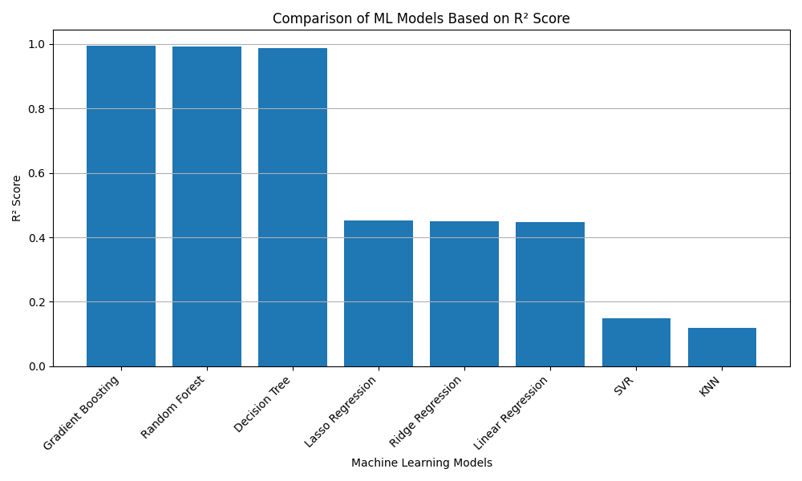
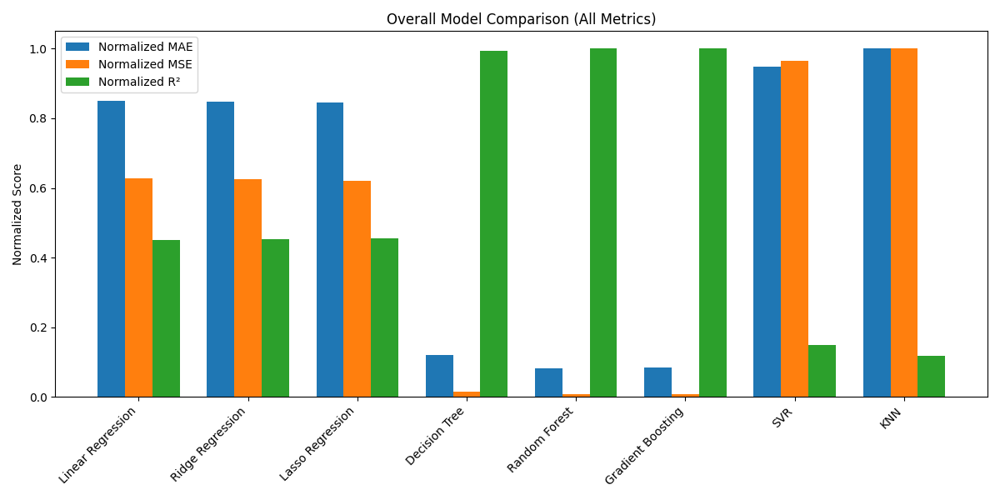

# 🔥 Combustion Temperature Prediction using Machine Learning

---

## 📌 1. Overview

This project builds a complete **data generation → machine learning → evaluation** pipeline to predict combustion flame temperature.

A dataset is generated using combustion simulations under varying operating conditions. Multiple regression models are trained to learn a predictive model that estimates flame temperature based on input parameters.

This project demonstrates:

- 🔥 Combustion data modeling  
- 📊 Regression analysis  
- 🤖 Machine learning model comparison  
- 📈 Performance evaluation  

---

## 🧪 2. Problem Statement

The goal is to predict **adiabatic flame temperature** based on key combustion parameters.

Instead of running computationally expensive simulations every time, a trained ML model can quickly approximate the output.

---

## 📥 3. Input Features

Each data sample includes:

| Feature | Description | Range |
|----------|------------|--------|
| equivalence_ratio (ϕ) | Fuel-to-air ratio relative to stoichiometric | 0.6 – 1.4 |
| initial_temperature (K) | Initial mixture temperature | 300 – 800 K |
| pressure_atm | Operating pressure | 1 – 10 atm |

---

## 🎯 4. Target Variable

| Output | Description |
|--------|------------|
| flame_temperature | Predicted combustion flame temperature (K) |

---

## 📊 5. Dataset Details

- Total samples generated: **1,000**
- Train/Test split: **80% / 20%**
- Features: 3 input variables
- Target: 1 continuous output

The dataset is structured for supervised regression.

---

## 🤖 6. Machine Learning Models Evaluated

The following models were trained and compared:

1. Linear Regression  
2. Ridge Regression  
3. Lasso Regression  
4. Decision Tree Regressor  
5. Random Forest Regressor  
6. Gradient Boosting Regressor  
7. Support Vector Regression (SVR)  
8. K-Nearest Neighbors (KNN)  

---

## 📏 7. Evaluation Metrics

Model performance was evaluated using:

- 📉 Mean Absolute Error (MAE)
- 📉 Mean Squared Error (MSE)
- 📊 R² Score

The best model was selected based on:

- Highest R² score  
- Lowest prediction error  

---

## 🏆 Results

### 📊 Model Performance Comparison

| Model | MAE | MSE | R² Score |
|-------|------|------|----------|
| Linear Regression | 105.06 | 14725.06 | 0.4478 |
| Ridge Regression | 104.85 | 14668.91 | 0.4499 |
| Lasso Regression | 104.58 | 14604.13 | 0.4523 |
| Decision Tree | 14.87 | 367.50 | 0.9862 |
| Random Forest | 10.23 | 185.32 | 0.9931 |
| Gradient Boosting | 10.44 | 171.13 | **0.9936** |
| SVR | 117.22 | 22699.15 | 0.1487 |
| KNN | 123.78 | 23504.76 | 0.1185 |

---

### 🥇 Best Model: Gradient Boosting Regressor

- **R² Score:** 0.9936  
- **MAE:** 10.44  
- **MSE:** 171.13  

Gradient Boosting achieved the highest R² score, indicating excellent predictive performance and strong generalization on unseen data.

Random Forest also performed extremely well, confirming that ensemble tree-based models are highly effective for this regression problem.

---

## 📈 Performance Visualizations

### R² Score Comparison

---

### Overall Model Comparison

## 📂 9. Sample Dataset Structure

| equivalence_ratio | initial_temperature | pressure_atm | flame_temperature |
|-------------------|--------------------|--------------|-------------------|
| 0.82 | 450 | 3.1 | 2054 |
| 1.05 | 600 | 5.4 | 2389 |
| 0.95 | 720 | 2.2 | 2321 |
| 1.20 | 500 | 8.7 | 2215 |
| 0.75 | 350 | 1.5 | 1890 |

*(Values vary per dataset generation)*

---

## 🏗 10. Workflow Architecture

---

## 🛠 11. Technologies Used

- 🐍 Python  
- 🔢 NumPy  
- 📊 Pandas  
- 🤖 scikit-learn  
- 📈 Matplotlib  

---

## ✅ 12. Conclusion

This project demonstrates how machine learning can be used to accurately predict combustion flame temperature from operating parameters.

By comparing multiple regression algorithms, the most effective predictive model was selected based on performance metrics.

The approach can be extended to:

- Emission prediction  
- Process optimization  
- Energy system modeling  
- Industrial parameter tuning  

---
